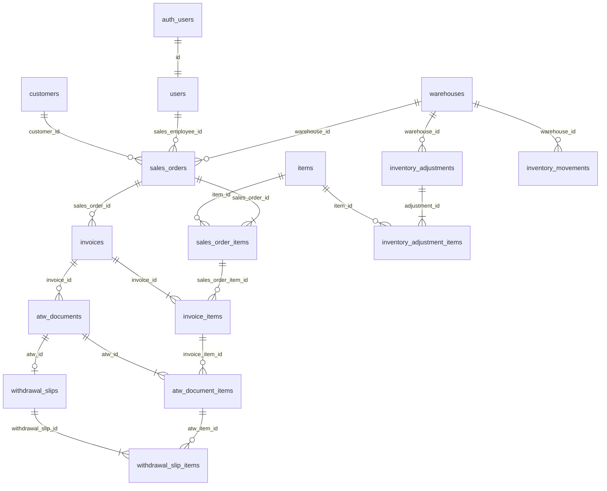

# Database

**Status:** approved. Apply `supabase/migrations/20260901000000_equinox_v1.sql` after the prototype migration (it replaces prototype objects).

PostgreSQL on Supabase is the source of truth. PKs are UUIDs. Invoice numbers are user-typed. SO/ATW/WS numbers are `SO-YYYY-NNNN` / `ATW-YYYY-NNNN` / `WS-YYYY-NNNN`. Historical snapshots are not updated when master data changes.

Money and quantity: `numeric(14,2)`.

## Tables (approved)

See field map in the previous revision; locked choices:

- `public.users` (not `profiles`): `username`, `full_name`, `department` (text), `role`, `status` (`active`/`inactive`). PK = `auth.users.id`. No password.
- `customers`: `name`, `billing_address`, `tin_number`, `status`, `contact_person`, `contact_number`.
- `items`: `name`, `description`, `brand`, `model`, `serial_no`, `barcode`. Catalog model (D7). No stock column on the item; on-hand is computed from `inventory_movements`.
- `warehouses`: one seeded **Main** row. `warehouse_id` is snapshotted on SO → Invoice → ATW/DR → WS.
- `inventory_adjustments` + `inventory_adjustment_items`: `ADJ-YYYY-NNNN`; status `draft` / `posted` / `cancelled`; line `direction` `increase` \| `decrease`.
- `inventory_movements`: append-only signed quantities. Sources: `adjustment`, `withdrawal_slip`.
- `sales_orders` + `sales_order_items`: snapshots; UOM and `unit_price` on the line; `amount = quantity * unit_price`; `total_amount = amount`.
- `invoices` + `invoice_items`: `sales_order_id` not null; `invoice_number` unique where status ≠ `cancelled`; `tax_amount` typed; `total_amount = amount + tax_amount`.
- `atw_documents` + `atw_document_items`: `document_type` `atw` \| `dr`; line `quantity` plus `invoice_item_quantity` snapshot.
- `withdrawal_slips` + `withdrawal_slip_items`: copies all ATW lines; line has `quantity` only (no line total_quantity).

Audit on transactional headers: `created_by`, `created_at`, `updated_by`, `updated_at`, `cancelled_by`, `cancelled_at`, `cancellation_reason`.

## Relationships



Child FKs to headers: `on delete restrict` for posted history. Draft line replace happens inside RPCs.

## Remaining quantity

```
so_remaining(so_item) =
  so_item.quantity
  − sum(invoice_items.quantity where same SO item and invoice.status <> cancelled)

invoice_remaining(inv_item) =
  inv_item.quantity
  − sum(atw_document_items.quantity where same invoice item and atw.status <> cancelled)
```

RPCs `SELECT … FOR UPDATE` parent lines, then insert. Isolation: READ COMMITTED + row locks.

## Unique withdrawal slip

```sql
create unique index withdrawal_slips_one_active_per_atw
  on withdrawal_slips (atw_id)
  where status <> 'cancelled';
```

## Writes

`authenticated`: SELECT on transactional tables. INSERT/UPDATE/DELETE of SO/Invoice/ATW/WS/adjustments only via `security definer` RPCs that check `current_user_role()`. Master data: RLS writes for `admin` and `sales`.

RPCs: `create_sales_order`, `open_sales_order`, `create_invoice`, `post_invoice`, `create_atw_document`, `release_atw_document`, `create_withdrawal_slip`, `issue_withdrawal_slip`, `cancel_sales_order`, `cancel_invoice`, `cancel_atw_document`, `cancel_withdrawal_slip`, `create_inventory_adjustment`, `update_inventory_adjustment`, `post_inventory_adjustment`, `cancel_inventory_adjustment`.

Cannot cancel a parent that still has a non-cancelled child.

## Inventory

```
on_hand(warehouse, item) = sum(inventory_movements.quantity)
reserved(warehouse, item) =
  sum(SO line qty where SO status in open/closed)
  − sum(issued WS qty for those SO lines)
available = on_hand − reserved
```

Draft SO does not reserve. Invoice/ATW/draft WS do not change on-hand. Issued WS inserts negative movements. Cancel issued WS inserts reversing positives. Posted decrease cannot exceed available. Opening an SO is rejected if required qty > available.

## Indexes

PKs; unique username; unique `so_number`, `atw_number`, `ws_number`; unique partial `invoice_number`; FKs; `items.barcode`; `status`; `order_date`; line parent ids; `atw_documents.document_type`.
